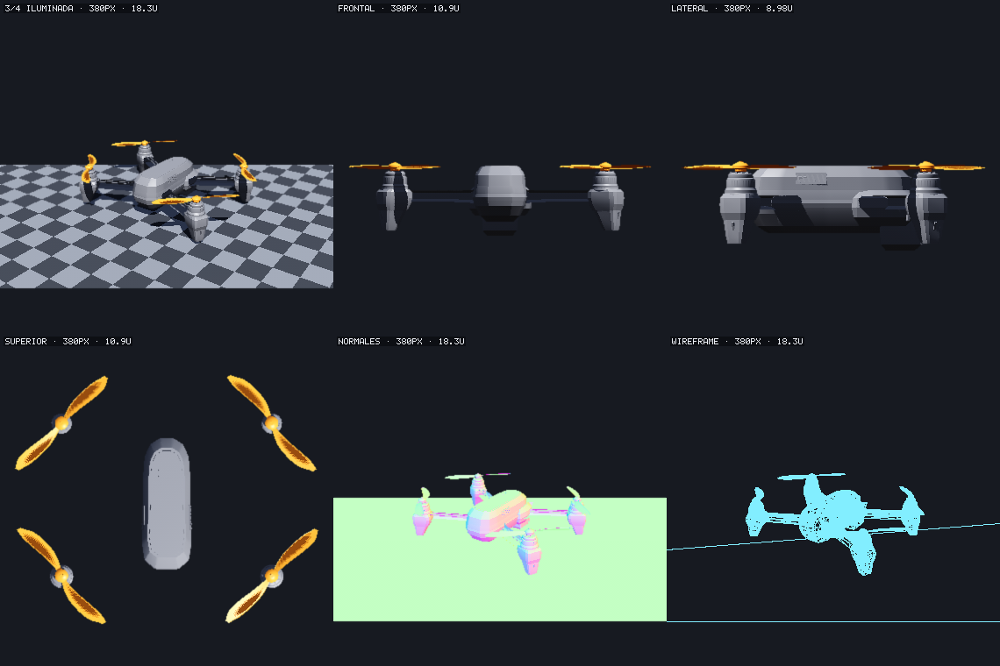

# softsight

**Software 3D rasterizer with an agent workbench. No GPU, no dependencies.**
Loads GLB/OBJ, renders contact sheets, audits topology, applies patches — headless,
deterministic, JSON in and out.

---

Rasterizador 3D por software —sin GPU y sin dependencias— con un banco de trabajo
headless para agentes de IA: carga GLB y OBJ, renderiza pliegos de contactos, audita
topología y aplica parches. Entra y sale JSON.

## Por qué existe

Un agente de IA que modifica geometría 3D trabaja a ciegas. Ve una imagen bonita y no
puede saber si la malla está cerrada, si una normal apunta al revés, si una pieza flota
en el aire o si el pivote quedará descentrado al rotar. Nada de eso se ve mirando.

softsight le da las dos cosas que le faltan: **una imagen que puede pedir barata y
repetible**, y **números exactos sobre lo que la imagen no muestra**. Y como el
renderizado es por software, el mismo código corre en el navegador, en Node y en una
tubería de integración continua sin GPU, sin drivers y sin sorpresas entre máquinas.

El dron de los ejemplos es el **espécimen de pruebas**: un modelo de 296 piezas con
nombres semánticos, generado proceduralmente, excepcionalmente bueno para ejercitar la
carga jerárquica, la selección por patrón y las auditorías.

## Arrancar

```bash
npm install
npm run dev
```

| Página | Qué es |
|---|---|
| `/soft.html` | **Rasterizador software**: pipeline completo en CPU |
| `/soft.html?bench=24` | Banco determinista, imprime el informe en pantalla |
| `/soft.html?workers=8` | Fuerza N hilos para medir el paralelo por bandas |

En `/soft.html` puedes **soltar un `.glb` o un `.obj`** sobre el visor, o usar los
botones para cargar los del repositorio.

## Crear un objeto desde cero

No hace falta un fichero de partida. La escena es JSON: primitivas con parámetros, o
mallas crudas con sus posiciones e índices, que es lo que produce cualquier generador
de geometría. El mismo informe —auditoría, contrato, pliego— juzga lo que acabas de
inventar.

```json
{
  "objects": [
    { "name": "fuste", "geometry": { "primitive": "box", "parameters": [1.1, 1.6, 1.1] },
      "position": [0, 1.05, 0] },
    { "name": "cubierta",
      "geometry": { "positions": [-0.7,0,-0.7, 0.7,0,-0.7, 0.7,0,0.7, -0.7,0,0.7, 0,0.85,0],
                    "indices": [0,4,1, 1,4,2, 2,4,3, 3,4,0, 0,1,2, 0,2,3] },
      "position": [0, 2.4, 0] }
  ],
  "budget": { "watertight": true }
}
```

Si la pirámide se deja sin base, el informe no se lo calla: `BORDE_ABIERTO: 4 aristas de
borde` y el contrato `watertight` incumplido, con salida 1. Y si se bobina del revés
—que no se ve en la imagen más que como una pieza oscura— salta `MALLA_INVERTIDA`, por
el signo del volumen.

Primitivas: `box`, `sphere`, `torus`, `plane`, `cylinder` y `cone`.

Crear es **incremental**: un parche puede añadir piezas, y aplicado a una escena edita
el documento, no la geometría. Lo que sale vuelve a ser una escena.

```bash
npm run agent3d -- --scene torre.json --patch anade-chimenea.json \
  --save-scene torre-v2.json --out torre-v2.png
```

```json
{ "edits": [
  { "op": "add", "object": { "name": "chimenea",
      "geometry": { "primitive": "cylinder", "parameters": [0.16, 0.9] },
      "position": [0.38, 2.1, 0] } },
  { "op": "translate", "target": "linterna", "delta": [0, 0.05, 0] }
] }
```

## Banco de trabajo para agentes

Escena o modelo dentro, pliego de contactos PNG y diagnóstico JSON fuera. Sin GPU,
sin navegador, sin servidor.

```bash
# Escena declarativa
npm run agent3d -- --scene artifacts/agent/ejemplo-dron.json --out revision.png

# Modelo real, con selección por patrón, parche y exportación
npm run agent3d -- --model artifacts/export/drone.glb \
  --select "rotor-*,propeller-*" \
  --patch artifacts/agent/patch-rotores.json \
  --export salida.obj --out revision.png
```



*`--select "rotor-*,propeller-*"` resalta en naranja las 24 piezas que encajan y apaga
el resto. El encuadre sigue a la selección. Cada tile lleva quemado su nombre y la
altura de mundo que abarca, para comparar escalas entre vistas sin volver al JSON.*

```bash
# Solo diagnóstico: piezas, familias y auditoría, sin renderizar nada
npm run agent3d -- --model artifacts/export/drone.glb --inspect-only

# Verificar un cambio: qué se movió en la imagen, cuánto y de qué pieza
npm run agent3d -- --model artifacts/export/drone.glb \
  --patch cambio.json --baseline anterior.png --out despues.png
```

Todo informe con pliego trae un `renderHash` —FNV-1a del búfer de color, uno por vista y
uno del pliego—, que responde «¿cambió algo?» comparando ocho caracteres, sin guardar
imágenes. Es reproducible desde el PNG, así que sirve de prueba de no regresión en CI.

Para eso el proyecto **fija la versión de Node** en `.nvmrc` y en `engines`. El render
es determinista dentro del mismo motor, pero `Math.sin`, `cos`, `tan` y `hypot` no están
especificados al último bit por el estándar —`+ - * / sqrt` sí—, así que comparar
imágenes exige el mismo aritmético a los dos lados.

Con `--baseline`, el informe trae además un `diff`: fracción del pliego que cambió,
desglose por vista, y las regiones con las piezas responsables. Dos renders sin cambios
dan **cero exacto**. Para que eso valga, con `--baseline` el encuadre y el volumen de la
sombra quedan fijados a los del modelo *antes* del parche: si no, mover una pieza
mueve la cámara y el pliego entero se desplaza un píxel.

`stdout` es JSON puro y el código de salida es 1 si hay avisos, así que encadena en CI
sin interpretar nada.

`--schema` imprime la forma aceptada de la escena y del parche, más un informe de
ejemplo. No es documentación aparte: el esquema **es** lo que valida la entrada, así que
no puede divergir del código, y una errata se caza con sugerencia en vez de ignorarse.

```
la escena no encaja con el esquema:
  - objects[0].positon no existe; ¿querías decir position?
```

`--help` lista todas las opciones: `--inspect-only`,
`--baseline pliego.png`, `--baseline-report informe.json`, `--select-where "expr"`,
`--patch` (repetible), `--undo`, `--dry-run`, `--save-scene`, `--no-cache`, `--tile N`,
`--isolate true`, `--audit-limit N`, `--ground false`, las de presupuesto y `--debug`.

El modelo analizado se guarda en `.cache/` con clave `(ruta, mtime, tamaño)`: analizar
el GLB del dron son 56 ms y leer la caché, 5 ms. El informe dice en `cached` de dónde
salió, y `--no-cache` la salta.

El informe trae, además del pliego: auditoría topológica por pieza —aristas de borde,
no manifold, triángulos degenerados, normales invertidas, desviación del pivote,
error de simetría—, resumen por familias de piezas, la caja en píxeles que ocupa cada
pieza auditada en cada vista, y avisos redactados como diagnóstico, no como métricas.
Cada aviso es `{ code, part, message }`: el texto lleva las cifras dentro y cambia en
cada ejecución, así que lo que se compara es el código.

### Auditoría entre piezas

Lo que ninguna imagen revela y ninguna auditoría de malla puede ver, porque el fallo no
está en una malla sino en la relación entre dos: piezas que se cruzan, piezas sueltas en
el aire, duplicados invisibles y hermanos fuera de escala. Va en `spatial` y en los
avisos, siempre, sin bandera.

En el dron de pruebas encontró esto, que llevaba ahí sin que nadie lo viera mirando
renders:

> `camera-front-element: no toca ninguna otra pieza. Está 0.3467 por encima del suelo
> del modelo, sin nada debajo, y a 0.0907 de camera-catchlight, que es la pieza más
> próxima.`

Todas son de caja envolvente, y los avisos lo dicen: son **candidatos**, no hechos
comprobados malla contra malla. El trabajo está en no avisar de lo legítimo: un solape
en el que una caja contiene entera a la otra es un alojamiento y calla; una pieza mucho
mayor que sus hermanos que además los contiene es la que los aloja y calla; una hélice
en el aire pero unida a su eje no flota, porque el criterio es **no tocar nada**, no
estar elevada; y la misma malla en distinta posición es una instancia, no un duplicado.

### El aviso trae su arreglo

Cuando existe una corrección que la herramienta pueda defender, el aviso la lleva
dentro como fragmento de parche. El agente lo aplica tal cual, sin deducir nada:

```json
{ "code": "PIEZA_FLOTANTE", "part": "volando",
  "message": "volando: no toca ninguna otra pieza…",
  "fix": { "op": "align", "target": "volando", "to": "base" } }
```

Los avisos **sin** `fix` no son un olvido: una malla abierta se cierra de muchas
maneras y ninguna es automática. Operaciones de arreglo: `align`, `setPivot`, `mirror`,
además de mover, girar, escalar, colorear, ocultar, borrar, renombrar y añadir.

### Probar, mirar, deshacer

```bash
npm run agent3d -- --model dron.glb --patch a.json --patch b.json \
  --undo deshacer.json --out revision.png
```

`--patch` es repetible y se aplica en orden. `--undo` escribe el parche inverso, que
devuelve el modelo a su estado exacto —misma huella de render—. `--dry-run` informa de
coincidencias y errores sin renderizar ni escribir nada.

### Escala absoluta

glTF mide en metros, así que un dron de 4,5 unidades **son 4,5 metros**, que es absurdo
para un cuadricóptero. `--expect-size 0.35` compara el lado mayor de la caja contra lo
que el objeto debería medir y nombra la unidad si el factor la delata:

> `la caja mide 350.000 m en su lado mayor y esperabas ~0.35 m (factor 1000.0); el
> modelo parece estar en milímetros.`

Sin la bandera solo se avisa fuera del rango 1 cm – 100 m, y el aviso dice siempre la
suposición de la que parte.

### Presupuesto como contrato

```bash
npm run agent3d -- --model artifacts/export/drone.glb --inspect-only \
  --max-parts 400 --require-watertight --max-symmetry-error 0.02
```

Cada bandera es una cláusula; incumplirla es un aviso con código propio y salida 1, así
que el agente sabe si su cambio cumple sin interpretar el JSON. Hay `--max-triangles`,
`--max-parts`, `--require-watertight`, `--max-boundary-edges`, `--max-degenerate` y
`--max-symmetry-error`; una escena declarativa lleva los mismos campos en `budget`. Las
cláusulas de topología auditan las 296 piezas —1,2 s frente a 0,16 s— y solo se pagan si
se piden.

Con `--baseline-report informe-anterior.json`, el informe trae `warningsDelta` con lo
nuevo, lo resuelto y cuántos avisos persisten. El agente solo mira `new`.

## Qué hay dentro

| Módulo | Contenido |
|---|---|
| `math.ts` | 4×4 row-major, matriz de normales, inversa afín |
| `projection.ts` | Perspectiva y ortográfica con profundidad invertida, planos del frustum |
| `clip.ts` | Recorte del plano cercano en espacio homogéneo |
| `raster.ts` | Span exacto, gradientes incrementales, regla top-left, curva ACES, dither |
| `shading.ts` | Blinn-Phong, ambiente hemisférico, filtrado analítico de textura |
| `shadowMap.ts` | Mapa de sombras direccional con profundidad lineal |
| `renderer.ts` | Orquestación: visibilidad, vértices, recorte, rasterizado, postproceso |
| `present.ts` | Buffer interno desacoplado del canvas visible |
| `resolutionController.ts` | Resolución adaptativa con modelo de coste ajustado en vivo |
| `parallel.ts`, `renderWorker.ts` | Paralelo por bandas con reparto adaptativo |
| `agent/` | Lectores GLB/OBJ, modelo direccionable, auditoría, pliego con rótulos, diff de renders |

Dependencias: **ninguna** en el núcleo. `meshoptimizer` es opcional y se carga bajo
demanda, solo si abres un GLB comprimido con `EXT_meshopt_compression`.

## Documentación

- [`docs/software-renderer.md`](docs/software-renderer.md) — cómo funciona y por qué:
  la matemática de la proyección, cada optimización con su medida, el banco de
  agentes, y qué formato conviene importar.
- [`docs/plan-renderizador.md`](docs/plan-renderizador.md) — el plan por fases con lo
  hecho, lo medido y lo pendiente. Incluye las ideas que se **descartaron por
  medida**, que suelen ser más útiles que las que funcionaron.
- [`docs/plan-agentes.md`](docs/plan-agentes.md) — plan para que un agente verifique
  sus cambios en vez de mirarlos: comparación de renders, auditorías espaciales entre
  piezas, consultas baratas y memoria entre llamadas.

## Cómo medir antes de optimizar

Tres herramientas, y conviene usarlas en este orden:

1. **Contadores deterministas** (`__softBench`): triángulos rasterizados, píxeles
   recorridos y sombreados. Son exactos y comparables entre sesiones. Si un cambio
   pretende ser exacto, estos números no deben moverse.
2. **Micro-banco aislado** en la consola, para atribuir un cambio concreto. El ruido
   del entorno es de ±25 % y se come cualquier mejora menor del 30 %.
3. **Barrido de resolución** con ajuste de `ms = fijo + porPíxel · píxeles`, para
   saber si lo que estorba es la geometría o el relleno. Las dos veces que me salté
   este paso, optimicé el término equivocado.

## Licencia

Apache-2.0. Copyright 2026 Jesús Galindez. Ver [`LICENSE`](LICENSE).

Sin dependencias en el núcleo. La única opcional, `meshoptimizer`, es MIT y solo se
carga si abres un GLB comprimido con `EXT_meshopt_compression`.
